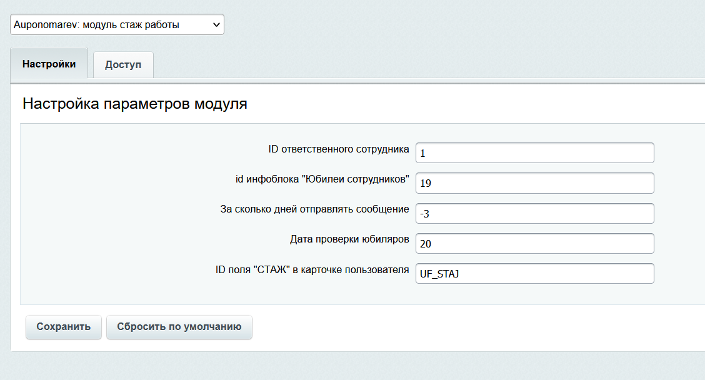

# Задача

1. Есть в профиле сотрудника поле «Стаж» (строка) в котором записывается автоматически величина стажа. 
     - Пример – «12 лет, 6 месяцев и 16 дней».
     - Нужно написать агента, который проверял бы раз в месяц (20 числа) стаж всех сотрудников,
     - на предмет наступления юбилея работы в компании на следующий месяц
     - и создавал бы по каждому из пользователей, попадающих в выборку,
     - элемент списка с заполнением значений, описанных в п.4.

2.	Юбилей компании – это 1 год, 5 лет, 10 лет и далее кратно 5 годам стажа.

3.	Список юбиляров должен содержать поля:
      - Название,
      - Дата создания,
      - Сотрудник (привязка к пользователю),
      - Дата юбилея (дата – записываем точную дату наступления юбилея),
      - Юбилей, лет (целое число – сюда записываем стаж на момент наступления юбилея).

4.	За 3 дня до наступления юбилея ответственному сотруднику должно приходить 
      - уведомление на почту о том,
      - что у сотрудника скоро юбилей – нужно составить поздравление.

# Модуль для битрикс 24

Модуль периодически проверяет стаж сотрудников, составляет список юбиляров и отправляет письмо уведомление о ближайшем юбилее.  

# Установка. 
- Модуль необходимо перенести на портал от корневого каталога сайта по следующему пути /local/modules/
- Модуль необходимо установить, как партнерский модуль в административном разделе http://{your_site}/bitrix/admin/partner_modules.php
- Если необходимо, модуль можно настроить.
 
